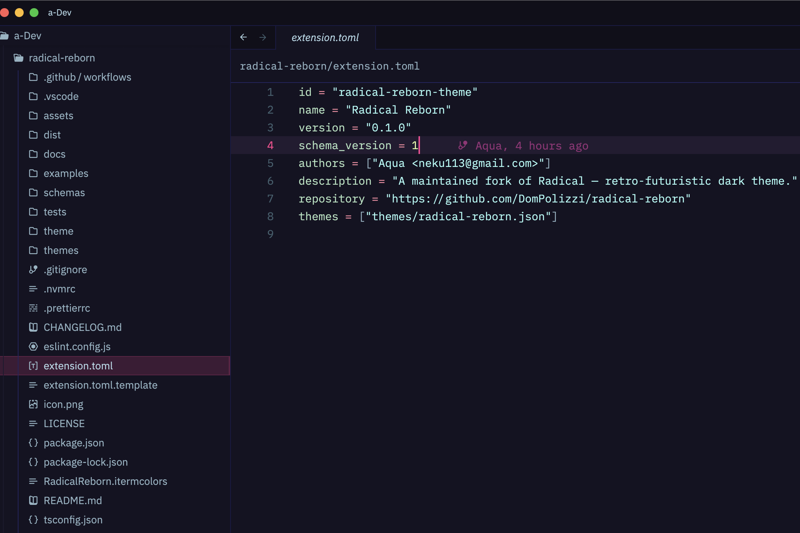

# Radical Reborn

A maintained fork of Dan Hedgecock's [Radical](https://github.com/DHedgecock/radical-vscode) — a retro-futuristic dark theme — extended for **VSCode** and **Zed**.



> **Status:** v0.1.0 — initial fork release.

## What's different from upstream Radical

- **Zed support** alongside VSCode, built from a single TypeScript palette + semantic-token core.
- **Modernized tooling** (TypeScript 5, tsx, ESLint flat config, Node 22 — Phase 2).
- **Coverage for newer editor surfaces**: AI completion preview (ghost text), parameter annotations (inlay hints), sticky scroll subheader, semantic tokens, version-control decorations.
- **APCA contrast pass** to verify body-text legibility (Phase 3).
- **MIT-licensed** (upstream is ISC; Zed Extensions registry no longer accepts ISC).

## Install

### VSCode (sideload — not on the Marketplace)

```sh
git clone https://github.com/DomPolizzi/radical-reborn
cd radical-reborn
npm install
npm run build
# Copy or symlink into your VSCode extensions dir, then reload
ln -s "$PWD" ~/.vscode/extensions/radical-reborn
```

Pick "Radical Reborn" from the theme picker (`Cmd/Ctrl-K Cmd/Ctrl-T`).

### Zed (Phase 4+)

Once published, install via the Zed Extensions panel: search "Radical Reborn".

## Acknowledgements

Original "Radical" theme by **[Dan Hedgecock](https://github.com/DHedgecock)**. This fork preserves the palette philosophy (pink/teal/lavender/chartreuse on a deep purple-black) while extending coverage to modern editor surfaces and porting to Zed.

## License

MIT — see [LICENSE](./LICENSE). Copyright Dan Hedgecock (2018, original) and Aqua (2026, fork).
