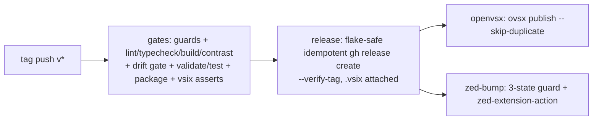

# ✨ Polish pass, v0.1.0 publish, and tag-push release automation

## Enhancement Summary

**Deepened on:** 2026-08-05, after initial drafting the same day.
**Research base:** 4 research agents (repo analysis, institutional learnings, CI/CD best practices verified against primary sources, schema/CLI currency) + SpecFlow gap analysis + a 6-reviewer panel (security, architecture, simplicity, deployment-verification, pattern-consistency, TypeScript).

### Key improvements from the deepen pass
1. **R1 contrast criterion was mathematically unsatisfiable** — measured APCA (validated against apca-w3 reference vectors): no color that reads as ultraviolet clears Lc 60 on `#141322` (`#864df8` = Lc 28.7; the first 260° hue to clear 60 is a pastel indistinguishable from the existing lavenders). Rewritten to the documented **Lc 45 emphasized-text tier + bold**, stop ≈ `#aa86fd` (Lc 47.5) — still a real upgrade over the outgoing pinks (Lc ~40, unmeasured today).
2. **Supply-chain hardening became mandatory, not optional**: SHA-pinned actions (the `tj-actions` compromise class — a mutable `@v2` on a single-maintainer repo next to publish tokens), exact-pinned `ovsx`/`vsce` (npx ranges resolve outside the lockfile at release time), machine-account-owned `COMMITTER_TOKEN` (a maintainer-account classic PAT can rewrite this repo's own pipeline — circular compromise), secrets in a `release` Environment bound to `v*` tags, `persist-credentials: false`, immutable releases enabled before v0.1.0.
3. **Guards re-balanced under the burn-the-version policy**: guards judged on false-positive cost. Cut from CI: CHANGELOG grep, non-empty secrets check (can't catch the realistic failure — an expired PAT; `ovsx verify-pat` in the pre-tag checklist can). Kept and made exact: ancestor-of-main (`fetch-depth: 0` removes the shallow-history flake risk). Strengthened: `.vsix` denylist grep → frozen-allowlist diff + payload byte-identity + post-package workspace re-check (tests execute arbitrary deps *after* the drift gate; `vsce` rebuilds during packaging).
4. **Drift protection moved two phases earlier** (it defends the plan's highest-rated risk): `check:drift` npm script lands in Phase 1 with a ci.yml step, and runs by hand in Phase 2 — not only in the Phase 3 pipeline. Ordering fixed: after `check:contrast`, or a stale committed `dist/apca-report.txt` is invisible forever.
5. **Idempotency holes closed**: release-create step is flake-safe (an API error can no longer trigger deletion of a *published* release); zed-bump guard now also skips on an **open** bump PR (the merged-state check alone re-runs into duplicate PRs during the ~25-min zed-zippy window).
6. **Go/No-Go verification appendix** with exact commands: pre-flight (package *before* tagging; `verify-pat` proves token + Eclipse agreement without publishing), per-channel post-publish checks incl. three-way SHA-256 byte-identity, a rollback drill to run *before* go-live, and an honest monitoring cadence (T+0 / T+1h / T+24h).

### Adjudicated reviewer conflicts (decisions final)
- **Keep `zed-bump-manual.yml`** (simplicity wanted it cut in favor of re-running old runs): GitHub re-runs expire ~30 days after a run; the observed first-submission merge latency was ~4 months. Guard-logic duplication with release.yml is accepted with keep-in-sync comments.
- **Keep the ancestor-of-main guard** (simplicity wanted it cut): Zed hard-requires the pinned submodule commit to be on a branch; exact ancestry via `fetch-depth: 0` removes the false-positive risk that motivated the cut.
- **Two palette stops, not one and not a ramp** (TypeScript wanted 2-stop unification incl. a third site; simplicity wanted 1 stop): every stop has a real consumer — `100` = the APCA-picked assertion color, `200` = `#864df8` unifying three drifted references (`RADVENDER`, `#874df8`, the inline `#874df84d` at `workbench.ts:788`). `#6e45c7`/`#9736c0` stay local.
- **Duplication over indirection for gates** (architecture): `workflow_call` would split jobs into separate workspaces, breaking the drift-gate/package single-workspace invariant; composite action deferred until a real divergence incident.

---

## Overview

The theme is fully built and quality-gated but has **never been distributed**: zero git tags, no GitHub Release, not on Open VSX ("Extension not found", verified 2026-08-05), not in the Zed registry (404). The June plan (`docs/plans/2026-06-09-001`) landed all in-repo packaging prep; its execution phases never ran.

This plan ships three milestones (see origin: `docs/brainstorms/2026-08-05-publish-and-release-automation-requirements.md`):

1. **Polish** (R1–R3): scrollbar + type-assertion colors, recommended-settings UX, generated-JSON audit — *before* the first published version.
2. **v0.1.0 first publish** (R4–R6): manual runbook execution — Zed registry submission, Open VSX, GitHub Release with `.vsix`.
3. **Release automation** (R7–R8): tag push → gates → `.vsix` → GitHub Release → Open VSX publish → Zed version-bump PR. Proven at v0.1.1.

Key decisions carried from origin: polish before publish; **full automation on tag push** (tokens in repo secrets); **v0.1.0 ships via the manual runbook, automation takes over at v0.1.1** (first Zed submission is a structurally different PR — confirmed: `zed-extension-action` is bump-only and hard-fails on absent extensions); **no Microsoft Marketplace** (reconfirmed 2026-08-05).

## Problem Statement

- Install today = clone-and-symlink (VSCode) or manual import (Zed). The README already *describes* the published future (Open VSX link, Zed panel, release downloads) — reality has to catch up.
- Known visual debt (`assets/TODO`): scrollbars derive from pink accent `#ff428e` at low alpha in **both** targets and read brownish; type assertions are hot pink instead of the intended ultraviolet.
- The generated JSON lags the engines: Zed's published v0.2.0 schema is frozen while the engine accepts ~47 newer keys (we already emit 9 of them unvalidated); VSCode gained keys (`editorBracketMatch.foreground`, `chat.*`) we don't cover.
- Every future release is a long manual runbook — and that runbook contains three known-wrong steps (see Phase 0).

## Proposed Solution

Five phases. 0–1 are local work, 2 is human-credentialed execution, 3 is CI work, 4 proves the pipeline.

```
Phase 0  Prep & truth alignment      (remote/auth fixes, runbook line-fixes in BOTH runbooks)
Phase 1  Polish: R1 colors, R2 settings UX, R3 audit + drift gate   → maintainer sign-off
Phase 2  v0.1.0 manual publish: GH Release + Open VSX + first Zed PR (Go/No-Go checklist)
Phase 3  release.yml automation + hardened secrets + runbook rewrite
Phase 4  Prove at v0.1.1 (after first Zed PR merges) + rollback drill + capture learnings
```

Release pipeline shape (fail-closed `needs:` DAG, build-once-promote-artifact):



---

## Technical Approach

### Phase 0 — Prep & truth alignment (~½ day)

**Maintainer-machine prerequisites:**

```bash
git remote set-url origin https://github.com/AquaOctet/radical-reborn   # currently SSH → DomPolizzi
gh auth login                                                            # currently unauthenticated
```

**Fix known-wrong runbook lines** — corrected *before* Phase 2 executes them, not in the Phase 3 rewrite:

1. `docs/runbooks/release.md` step 2 says "verify `dist/apca-report.txt` produced" after `npm run build` — the build orchestrator never writes it (`theme/build-all.ts:35-47` runs only the two adapter builds; only `npm run check:contrast` writes the report via `theme/apca-check.ts:40-41`). Fix the step to run `check:contrast` explicitly; also fix the stale comment at `apca-check.ts:9-10` claiming the orchestrator calls it. (Origin scope boundary: no pipeline rearchitecture — fix the docs, not the orchestrator.)
2. Step 5 creates a **lightweight** tag while step 6b uses `--notes-from-tag`, which needs an **annotated** tag. Decision: **annotated tags** whose message is the CHANGELOG entry; `git tag -a "v<NEW VERSION>" -m "<changelog section>"` (keep the runbook's `<NEW VERSION>` placeholder style).
3. Step 7 claims new-extension PRs "auto-merge on green within ~12–24h". Wrong: **new** submissions are human-merged and can take days-to-weeks (observed: extensions PR #5385 opened 2026-03-25, merged 2026-07-21); requires signing Zed's CLA. Only *version bumps* auto-merge, via `zed-zippy[bot]`. **`docs/runbooks/rollback.md` lines 14 and 79 carry the same stale cadence — fix both files.**

**Fix the README's phantom filename** (`README.md:29-33`): it instructs downloading `radical-reborn-<version>.vsix`, but the package script emits `--out radical-reborn.vsix` (unversioned, `package.json:48`). Decision: keep the **unversioned artifact name** everywhere (one filename in script, workflow, runbook, README; the release page provides version context) and correct the README lines. (Alternative — versioned `vsce` default naming — rejected: adds globbing to every consumer for zero user benefit.)

### Phase 1 — Polish: R1–R3 + drift gate (~1–2 days)

#### R1 — Colors

**Palette: add `ULTRAVIOLETS` with exactly two earned stops** (`theme/palette.ts`, `as const satisfies HexStops`, stops start at 100 per the existing group convention, lightest first):

- `ULTRAVIOLETS[100]` — the **text-grade assertion color**, picked to clear APCA Lc 45 against `bgPrimary #141322` with margin: ≈ `#aa86fd` (Lc 47.5) or `#ad8afd` (Lc 49.2). This stop is APCA-derived first, aesthetics second.
- `ULTRAVIOLETS[200]` = `#864df8` — **chrome/selection grade**, unifying three historically-drifted references: `RADVENDER #864df8` (`theme/vscode/workbench.ts:76`), `HIGHLIGHT_CURRENT_SELECTION #874df8` (:88 — same color one digit apart), and the inline `'#874df84d'` at `workbench.ts:788` (`terminal.selectionBackground` → `alpha(ULTRAVIOLETS[200], 0.3)`).
- Doc comment disambiguating the two purple families — ULTRAVIOLETS = saturated ~260° blue-violets (selection/assertion emphasis) vs LAVENDERS = pale orchids (types) — and stating stop-ordering, since LAVENDERS' own ordering is not luminance-monotonic.
- `#6e45c7` (:89) and `#9736c0` (:90, actually 282° purple — folding it in would make the ramp lie) **stay local**. No speculative ramp: stops = consumers. While touching the block, collapse the duplicate `HUE_PURPLE`/`HIGHLIGHT_CURRENT_LINE` consts (both `#d043cf`, :82/:86) — keep local.

**Semantic slot + APCA pair (the tier contract):** `SEMANTIC_PAIRS` entries must draw `fg` from `semantic.*` (`theme/utils/apca-pairs.ts:5-8`) — a pair referencing a raw palette stop would be the file's first tier violation *and* could pass while `tokens.ts` ships a different stop. So:

- `theme/semantic.ts`: add `typeAssertion: ULTRAVIOLETS[100]` (camelCase, matching `parameterAnnotation`; opaque 6-digit — `calcAPCA` ignores alpha, so an alpha'd hex would silently measure the un-composited color).
- `theme/vscode/tokens.ts` consumes `colors.typeAssertion` for all three assertion scopes: `keyword.control.as` (:45-52, keeps bold underline) and `keyword.operator.type.asserts` / `keyword.operator.expression.is` (:53-59, **gain bold** — required to justify the Lc 45 emphasized-text tier, and coherent with "assertions pop").
- `theme/utils/apca-pairs.ts`: `{ name: 'typeAssertion', fg: semantic.typeAssertion, bg: semantic.bgPrimary, minLc: 45 }` — **passing, not exempted**. Lc 45 is the documented tier in `theme/utils/apca.ts` for emphasized/large text. (Lc 60 is unsatisfiable for a genuine violet on this background — measured, see Enhancement Summary. The outgoing `PINKS[600]`/`[500]` measure Lc 39.7/41.6 and were never gated, so this is a contrast ratchet, not a relaxation.)

**Scrollbars → lavender family** (matching the line-highlight direction; Zed active line is already `alpha(LAVENDERS[400], 0.08)`, `theme/zed/style.ts:16`). Hoist shared consts so scrollbar and minimap values cannot drift apart:

| Key | Current | Target |
| --- | --- | --- |
| Zed `scrollbar.thumb.background` / `.hover_background` (`style.ts:98-99`) | `alpha(accent #ff428e, 0.2 / 0.35)` | hoisted `SCROLLBAR_THUMB` consts: `alpha(LAVENDERS[400], ~0.2 / ~0.35)` |
| Zed `minimap.thumb.*` | **unemitted** (R3 adoption) | same hoisted consts |
| VSCode `scrollbarSlider.{background,hoverBackground,activeBackground}` (`workbench.ts:213-217`) | `alpha(PRIMARY #ff428e, 0.1/0.25/0.4)` | lavender-family equivalents, shared consts |
| VSCode `scrollbar.shadow` (`workbench.ts:213`) | `SHADOW` const | **new local value at the key site** — do NOT recolor the `SHADOW` const at :121: it also feeds `widget.shadow` (:152), which R1 does not claim |
| VSCode `minimapSlider.*` | **unset** | add in the existing `minimap` group (`workbench.ts:522`), mirroring `scrollbarSlider` via the shared consts |

**Zed asymmetry (documented, not worked around):** assertions map to generic `keyword`/`operator` canonical keys (`theme/mappings/tm-to-canonical.ts:101-103`) — no assertion-specific key exists in Zed's syntax set; recoloring would hit *all* keywords. Types are **already lavender** in both targets (Zed `type` → `LAVENDERS[500]` italic, `syntax.ts:53`; VSCode `entity.name.type` → `LAVENDERS[500]`, `support.type` → `LAVENDERS[200]`) — verify, don't churn. Fix the stale comments at `tm-to-canonical.ts:101-102` claiming "bold/underline preserved" (Zed drops underline entirely, `theme/utils/font-style.ts:26-36`).

**Sign-off gate:** build both targets, side-by-side check against the current build (Zed dev-extension install + VSCode `.vsix` from a clean profile), maintainer approves before Phase 2 (origin success criterion).

#### R2 — Recommended-settings UX

The snippet file is *already linked* from the README (`README.md:88`) — do not double-add. Remaining work:

- New **"Overrides"** section in the README (currently zero matches for "override"): how users layer `experimental.theme_overrides` (Zed) / `workbench.colorCustomizations` + `editor.tokenColorCustomizations` (VSCode) on top of the theme, with one worked example each.
- Promote the copy-paste settings pointer near the install section so new installs see it immediately.

#### R3 — Generated-JSON audit (narrowed: audit ≠ re-theming)

**Refresh validation first, or the audit is self-certifying.** The vendored `schemas/zed-v0.2.0.json` (byte-identical to the live URL, which is frozen at the 2024 shape) contains none of the newer engine keys, and the style object is open — `npm run validate` passes any key *including typos*. Approach (per TypeScript review):

1. **Keep the vendored file pristine** (its name and re-verifiability against the live URL stay honest). Add `schemas/zed-v0.2.0-extended.json` containing **only the keys we actually adopt** — not the ~47-key engine catalog — with one top-level `$comment` (provenance: audit doc + `crates/settings_content/src/theme.rs` @ pinned sha; draft-07 supports `$comment` natively) . Repoint exactly two references: `package.json:46` (`validate`) and `tests/schema.test.ts:18`.
2. **New test — the audit's one permanent correctness fix**: a second `describe` inside `tests/schema.test.ts` (it already loads both JSON files — reuse the loads). Assert every key of `theme.themes[0].style` ∈ the extended schema's `ThemeStyleContent.properties` (keys-only; do **not** recurse into `syntax` — its contents are compile-time-gated by `Partial<Record<ZedSyntaxKey, …>>` in `theme/zed/syntax.ts:33`, stronger than any runtime check; note that in a test comment). Include the conventions: file docstring stating the regression caught, failure message naming the file to fix, and an anti-vacuous sanity assertion (schema property count above a floor). Add a small `DEPRECATED_ZED_KEYS` test asserting each (`scrollbar_thumb.background`, `version_control.conflict_{ours,theirs}_background`) is (a) not emitted and (b) **not in the schema** — (b) is the ratchet that stops a future failure being "fixed" by whitelisting the deprecated key.
3. **Disposition table** — committed to `docs/audits/2026-08-05-theme-json-audit.md` (full-date filename; solutions-style frontmatter: title/date/tags/component). **Default disposition is `skip — editor default acceptable; revisit on user report`**; a skip row costs one line and fully honors origin R3. Family rows (one line each), not per-key: `vim.*`, `chat.*`, `inlineEdit.*`, `debugger.*` — these are new theming decisions for surfaces the maintainer has never seen, i.e. the re-theming origin excluded. **Earned adoptions only:** `minimapSlider.*` / Zed `minimap.thumb.*` (rides the R1 scrollbar fix), and the 3 in-schema unemitted Zed keys (`background.appearance`, `pane.focused_border`, `pane_group.border`) *only if* the current default is visibly wrong. Record the two deliberate asymmetries: ultraviolet assertions VSCode-only; Zed player-0 selection is pink-based (`theme/zed/players.ts:21`) while VSCode selection is violet.

#### Drift gate (moved up from Phase 3 — it defends this plan's highest-rated risk)

- `package.json`: add `"check:drift": "git diff --exit-code dist/ themes/ extension.toml"` (verb:target naming, one-name-many-consumers).
- `ci.yml`: named step running `npm run check:drift` **after** the APCA step (only `check:contrast` writes `dist/apca-report.txt` — placed earlier, a stale committed report is invisible forever). Add keep-in-sync cross-reference comments between ci.yml and the future release.yml gates.
- All Phase 1 changes flow through `theme/` sources; rebuild; update snapshots (`npx vitest run -u`, review the diff — every color change surfaces there); **commit source + `dist/` + `themes/` + `extension.toml` + snapshots together** — now machine-enforced at PR time.

### Phase 2 — v0.1.0 first publish, manual (~½ day + registry wait)

**One-time, human-credentialed setup** (none automatable; ordered before any publish):

- [ ] Open VSX: GitHub sign-in at open-vsx.org → **sign the Eclipse Publisher Agreement** (its absence masquerades as a token error — `docs/solutions/2026-06-09-openvsx-publisher-agreement.md`) → create local token → create namespace **without putting the token in argv/history**: `OVSX_PAT=<token> npx ovsx create-namespace aquaoctet` (ovsx reads the env var). Optionally file the EclipseFdn ownership claim (the listing shows an "unverified" badge until then — expected, not a failure).
- [ ] **Create the machine account** (e.g. `aquaoctet-bot`; a machine user is a personal account, satisfying the registry's personal-not-org fork rule): it forks `zed-industries/extensions`, signs Zed's CLA, and owns `COMMITTER_TOKEN` (Phase 3). The human maintainer signs the CLA separately (author of the manual v0.1.0 PR).
- [ ] Second Open VSX token scoped for CI (separate token per environment, per Open VSX guidance) — stored in Phase 3.
- [ ] Enable **immutable releases** on the repo (closes the asset-swap-after-publish tamper vector on the channel the README sends stock-VSCode users to).

**Pre-flight (Go/No-Go — any failed line = No-Go; full command set in the Verification appendix):**

1. Identity: `git remote get-url origin` exact-matches the HTTPS URL; `gh auth status` green; `git push --dry-run origin main`.
2. Tag hygiene: `git tag -l v0.1.0` and `git ls-remote --tags origin v0.1.0` both empty (burn-version policy).
3. Local guard replica: package.json + extension.toml + CHANGELOG heading all agree on `0.1.0` (the CHANGELOG entry re-dated to ship date, absorbing the Phase 1 polish — it currently reads `2026-05-08` and predates all of it).
4. `npm run build && npm run check:contrast && npm run check:drift` — the manual split-brain gate protecting the future Zed submodule pin.
5. All gates: `npm run lint && npm run typecheck && npm run validate && npm test`; CI green at the exact SHA.
6. **Package BEFORE tagging** (catches `.vscodeignore` problems without burning the tag): `npm run package`; verify listing; clean-profile install test; **freeze the allowlist**: `unzip -Z1 radical-reborn.vsix | LC_ALL=C sort > .github/vsix-manifest.txt` and commit it (Phase 3's assert diffs against this hand-verified listing).
7. Publish preconditions without publishing: `curl -s -o /dev/null -w '%{http_code}' https://open-vsx.org/api/aquaoctet` → 200; `npx ovsx verify-pat aquaoctet` with the local token (proves token + agreement).

**Release execution (patched runbook):**

1. Annotated tag: `git tag -a v0.1.0 -m "<CHANGELOG 0.1.0 section>"`; verify `git for-each-ref refs/tags/v0.1.0 --format='%(objecttype)'` prints `tag`; push main + tag.
2. `gh release create v0.1.0 radical-reborn.vsix --verify-tag --notes-from-tag`.
3. `OVSX_PAT=<local token> npm run publish:ovsx` → verify via the Open VSX API (version, files, README/icon render) and a VSCodium search-install.
4. **First Zed submission** (manual by design, from the human's clone of the machine-account fork or the human's own fork): `git submodule add https://github.com/AquaOctet/radical-reborn extensions/radical-reborn-theme` (HTTPS; pinned commit must be on a branch) → `extensions.toml` entry → `pnpm sort-extensions` → PR. Expect human review; CLA check must go green.
5. Add a **"pending registry review"** note to the README's Zed section (the "install via Zed panel" claim is otherwise false for weeks) — removed when the PR merges.
6. **Scheduled follow-up at merge** (days-to-weeks later): verify panel install, remove the pending note, run the version-consistency one-liner (appendix). This decoupled tail is expected, not a failure.

### Phase 3 — Release automation: R7–R8 (~1 day)

#### Secrets & supply-chain model (hardened — mandatory, not advisory)

- **`COMMITTER_TOKEN`** — classic PAT (fine-grained still can't do fork→upstream PRs, verified mid-2026), created on the **machine account, never the maintainer account**: a maintainer-account classic PAT is account-wide — leaked, it could rewrite *this repo's own release.yml* and ship a malicious `.vsix` through the pipeline it guards (circular compromise). Machine-account blast radius = one disposable fork. `repo` + `workflow` scopes, 90-day expiry, rotation + compromise-revocation steps in the runbook.
- **Both secrets live in a GitHub Environment named `release`** with a deployment tag rule `v*` — not repo-wide secrets. Jobs declare `environment: release`; a future or modified workflow on a branch cannot read them. (Required reviewers stay off — origin chose full automation.)
- **SHA-pin every `uses:`** in release.yml and zed-bump-manual.yml (40-char SHA + version comment). `@v2` on a single-maintainer personal repo executing beside `COMMITTER_TOKEN` is exactly the `tj-actions/changed-files` compromise class. Add `.github/dependabot.yml` (`package-ecosystem: github-actions`, monthly) so pins don't fossilize. Optional: repo Actions allowlist (`actions/*` + the one listed third-party action).
- **Exact-pin the npx tools**: `publish:ovsx` → `ovsx@1.1.0` exact; `package` → exact `@vscode/vsce@3.x.y`. npx semver ranges resolve from npm *at release time, outside the lockfile* — a malicious ovsx point-release is token exfiltration; a malicious vsce point-release is artifact tampering. Version bumps happen by editing the script line in a reviewed PR (this makes the risk table's "bump deliberately" true instead of aspirational).
- `persist-credentials: false` on all checkouts (npm's dependency tree shouldn't share a job with a persisted token; revisit if the repo ever goes private — the guard's `git fetch` relies on anonymous HTTPS).
- Log hygiene: no `set -x`/`echo`/`printenv` in any step whose env holds a secret (masking covers exact values only, not transforms).

#### `.github/workflows/release.yml`

Four jobs, strict `needs:` DAG. Every step named (ci.yml convention), block-style YAML, `defaults.run.shell: bash` (gives multi-line steps `pipefail`). `<sha>` placeholders resolved at implementation time.

```yaml
name: Release
on:
  push:
    tags: ["v*"]

permissions:
  contents: read

defaults:
  run:
    shell: bash

concurrency:
  group: release            # fixed name: serializes distinct tags too; never cancel a publish
  cancel-in-progress: false

jobs:
  gates:
    runs-on: ubuntu-latest
    environment: release
    steps:
      - uses: actions/checkout@<sha>            # v4 — SHA-pin all uses: in this file
        with:
          fetch-depth: 0                        # exact ancestry for the on-main guard; repo is tiny
          persist-credentials: false
      - uses: actions/setup-node@<sha>          # v4
        with:
          node-version-file: .nvmrc
          cache: npm
      - name: Guards (before npm ci — bad tags reject in seconds)
        run: |
          # strict semver (rejects v0.1.2-rc1 sneaking through the v* glob; Open VSX has no unpublish)
          [[ "$GITHUB_REF_NAME" =~ ^v[0-9]+\.[0-9]+\.[0-9]+$ ]] || { echo "::error::non-release tag"; exit 1; }
          TAG_V="${GITHUB_REF_NAME#v}"
          # tag ↔ BOTH manifests (Zed rejects extensions.toml ≠ extension.toml mismatches)
          PKG_V="$(node -p "require('./package.json').version")"
          ZED_V="$(grep -m1 '^version' extension.toml | sed 's/.*"\(.*\)"/\1/')"
          [ "$TAG_V" = "$PKG_V" ] && [ "$TAG_V" = "$ZED_V" ] || { echo "::error::tag v$TAG_V != package.json ($PKG_V) or extension.toml ($ZED_V)"; exit 1; }
          # tag commit on main (Zed requires the pinned submodule commit to be on a branch)
          git merge-base --is-ancestor "$(git rev-parse 'HEAD^{commit}')" origin/main || { echo "::error::tag not on main"; exit 1; }
      - name: Install dependencies
        run: npm ci
      - name: Lint
        run: npm run lint
      - name: Typecheck
        run: npm run typecheck
      - name: Build (VSCode + Zed)
        run: npm run build
      - name: APCA contrast check
        run: npm run check:contrast
      - name: Committed artifacts match source (split-brain gate)   # keep in sync with ci.yml
        run: npm run check:drift               # after contrast: also catches a stale committed apca-report.txt
      - name: Validate Zed JSON against extended schema
        run: npm run validate
      - name: Tests
        run: npm test
      - name: Package .vsix
        run: npm run package
      - name: Workspace unchanged through packaging      # tests + vsce's prepublish rebuild ran arbitrary deps
        run: |
          git diff --exit-code -- theme/ dist/ themes/ extension.toml package.json
          [ -z "$(git status --porcelain -- theme/ dist/ themes/)" ]
      - name: Assert .vsix contents (frozen allowlist + payload identity)
        run: |
          unzip -Z1 radical-reborn.vsix | LC_ALL=C sort | diff -u .github/vsix-manifest.txt -
          unzip -p radical-reborn.vsix extension/dist/RadicalReborn.json | diff -q - dist/RadicalReborn.json
          unzip -p radical-reborn.vsix extension.vsixmanifest | grep -q "Version=\"${GITHUB_REF_NAME#v}\""
      - uses: actions/upload-artifact@<sha>     # v4
        with:
          name: vsix
          path: radical-reborn.vsix
          if-no-files-found: error

  release:
    needs: gates
    runs-on: ubuntu-latest
    permissions:
      contents: write
    steps:
      - uses: actions/download-artifact@<sha>   # v4
        with:
          name: vsix
      - name: Create GitHub Release (idempotent, flake-safe)
        env:
          GH_TOKEN: ${{ github.token }}
          GH_REPO: ${{ github.repository }}
          TAG: ${{ github.ref_name }}
        run: |
          set -euo pipefail
          # Three-state machine: API errors must NOT fall through to deletion of a published release.
          if state=$(gh release view "$TAG" --json isDraft -q .isDraft 2>err.txt); then
            if [ "$state" = "true" ]; then
              gh release delete "$TAG" --yes    # clear a partial draft from a dead run — drafts only
              gh release create "$TAG" ./radical-reborn.vsix --verify-tag --notes-from-tag
            else
              echo "Release $TAG already published — safe re-run, skipping"
            fi
          elif grep -qi 'not found' err.txt; then
            gh release create "$TAG" ./radical-reborn.vsix --verify-tag --notes-from-tag
          else
            cat err.txt; echo "::error::could not determine release state"; exit 1
          fi

  openvsx:
    needs: release
    runs-on: ubuntu-latest
    environment: release
    steps:
      - uses: actions/checkout@<sha>            # v4 — MUST precede artifact download (checkout cleans the workspace)
        with:
          persist-credentials: false
      - uses: actions/setup-node@<sha>          # v4 — no `npm ci`: publish:ovsx is pure exact-pinned npx
        with:
          node-version-file: .nvmrc
      - uses: actions/download-artifact@<sha>   # v4
        with:
          name: vsix
      - name: Publish to Open VSX (idempotent)
        run: npm run publish:ovsx -- --skip-duplicate    # exits 0 if this version is already live
        env:
          OVSX_PAT: ${{ secrets.OVSX_PAT }}

  zed-bump:
    needs: release
    runs-on: ubuntu-latest
    environment: release
    permissions: {}                              # node action operates purely via COMMITTER_TOKEN; no checkout
    steps:
      - name: Skip if absent, already bumped, or bump PR already open   # keep in sync with zed-bump-manual.yml
        id: guard
        env:
          GH_TOKEN: ${{ secrets.COMMITTER_TOKEN }}
        run: |
          V="${GITHUB_REF_NAME#v}"
          TOML="$(curl -fsSL https://raw.githubusercontent.com/zed-industries/extensions/main/extensions.toml)"
          if ! grep -q '^\[radical-reborn-theme\]' <<<"$TOML"; then
            echo "::warning::extension not in registry yet (first-submission PR unmerged) — catch up via zed-bump-manual"
            echo "skip=true" >> "$GITHUB_OUTPUT"
          elif grep -A4 '^\[radical-reborn-theme\]' <<<"$TOML" | grep -q "version = \"$V\""; then
            echo "already at $V — safe re-run, skipping"; echo "skip=true" >> "$GITHUB_OUTPUT"
          elif [ -n "$(gh search prs --repo zed-industries/extensions --state open 'radical-reborn-theme' --json number --jq '.[].number')" ]; then
            echo "open bump PR exists — safe re-run, skipping"; echo "skip=true" >> "$GITHUB_OUTPUT"
          fi
      - uses: huacnlee/zed-extension-action@<full-40-char-sha>   # v2.0.0
        if: steps.guard.outputs.skip != 'true'
        with:
          extension-name: radical-reborn-theme   # explicit — default would wrongly resolve to 'radical-reborn'
          push-to: <machine-account>/extensions  # the machine account's fork
        env:
          COMMITTER_TOKEN: ${{ secrets.COMMITTER_TOKEN }}
```

Deliberately **not** in the gates job (judged on false-positive cost under burn-the-version): a CHANGELOG-heading grep (notes come from the annotated tag; the heading check lives in the pre-tag checklist where failing costs nothing) and a non-empty secrets check (cannot catch the realistic failure — an *expired* PAT; `ovsx verify-pat` in the pre-release checklist can, and every channel step is idempotent-re-runnable after rotation).

#### `zed-bump-manual.yml` (catch-up + rollback dispatch)

Kept as a separate workflow: GitHub run re-runs expire ~30 days after the run, while the observed first-submission merge latency was ~4 months — "re-run the old tag's job" is not a reliable catch-up path, and a separate workflow gives rollback its own audit trail with zero repo permissions. Requirements: `workflow_dispatch` with a `tag` input; same top-level `contents: read`, job `permissions: {}`, `environment: release`, SHA-pinned action; **the input reaches shell only via `env:`** (never `${{ inputs.tag }}` inside `run:` — it is the one user-typed value in the system); first step revalidates `^v[0-9]+\.[0-9]+\.[0-9]+$` and `git ls-remote --exit-code origin "refs/tags/$TAG"`; then the same 3-state guard and the action with `tag: <validated input>`. Parameterized by version it serves both **catch-up** (after the first Zed PR merges) and **rollback downgrade** (rollback.md flow; comment the `Rollback:` prefix on the PR by hand — the action templates its own title).

#### R8 — runbook rewrite (`docs/runbooks/release.md` + `rollback.md`)

Reorient release.md around "bump + CHANGELOG + annotated tag push; CI does the rest"; keep the full manual flow as fallback; keep the numbered-step + checklist skeleton and render failure policies as a decision-matrix table (house style). Content additions:

- **Failed gates at a tag → burn the version.** Fix forward, bump patch, new tag. Never move or delete a pushed `v*` tag.
- **Partial publish → "Re-run failed jobs"**; every channel step is idempotent (flake-safe release create, `--skip-duplicate`, 3-state zed-bump guard). Artifact retention caveat: past ~30 days re-runs are unavailable and ~90 days artifacts expire — fall back to the manual runbook.
- **Queued-run caveat**: `group: release` keeps at most one *pending* run — push one tag at a time; if a queued run shows "canceled", re-run it after the active one finishes.
- **Rollback per channel**: Zed = downgrade PR via zed-bump-manual (same mechanics as release); GitHub = annotate, never delete, plus `gh release edit <last-good> --latest` to repoint the "latest" pointer; **Open VSX = no unpublish — publish-fixed-version-forward** (fills the documented gap in rollback.md). Font-not-applied reports are user-side config (`docs/solutions/2026-06-09-zed-font-not-applied…`) — explicitly a rollback **non-trigger**.
- **Credential compromise section**: revoke at open-vsx.org token settings + revoke the machine-account PAT; malicious Open VSX versions cannot be self-removed — contact Open VSX admins, publish fixed version forward.
- **Monitoring reality** (this is the entire monitoring plan — write it as such): one-time — enable Actions failure emails, watch the repo (Issues). Per release: **T+0** the tag-pusher runs `gh run watch <id> --exit-status` until green (the only synchronous window that exists); **T+1h** zed-zippy merged the bump PR + version-consistency one-liner; **T+24h** Open VSX listing renders + skim issues/reviews. If `COMMITTER_TOKEN` lives on a machine account, its PR notifications land where nobody reads — the T+1h `gh pr list` check is load-bearing, and Subscribe on the PR when one opens.

### Phase 4 — Prove automation at v0.1.1 + rollback drill (opportunistic, after the first Zed PR merges)

1. Ship a real v0.1.1 (candidates: post-launch nits, audit follow-ups, README pending-note removal). **The first release.yml execution is a production release by construction** — the strict-semver guard rejects rehearsal tags deliberately; worst case is a burned patch number, which the failure policy accepts. (Optional escape hatch: rehearse in a scratch fork with dummy secrets.)
2. Smoke-verify during the run (`gh run watch`): job ordering (gates → release → openvsx ∥ zed-bump), release job does no build (build-once proof), zed-bump guard prints no skip warning.
3. Post-run: three-way SHA-256 identity (CI artifact = Release asset = Open VSX download); bump PR diff is exactly 2 changes (toml version + submodule gitlink), merged by `zed-zippy[bot]`; consistency one-liner prints CONSISTENT; maintainer actions were exactly bump + CHANGELOG + tag push. Then the **idempotency drill**: "Re-run all jobs" on the green run → all green, zero duplicates.
4. **Rollback drill (before it's ever needed; a path first exercised mid-incident is not a path):** verify `COMMITTER_TOKEN` account + scopes via the API scope header (absent header = fine-grained = wrong token type); fork-only downgrade dry-run (submodule checkout at v0.1.0, `pnpm sort-extensions` — first run of that tooling must not be during an incident, push + delete the drill branch, **never open the practice PR against upstream**); `gh release edit --latest` repoint and back; tag self-sufficiency (fresh clone at tag → `npm ci && npm run build`). Integration scenarios that must **not** be executed live: drift-failure (test via a throwaway PR against the ci.yml gate, not a burned tag) and a real rollback dispatch (verified by inspection — same guard + action at a parameterized tag).
5. Record tag-push → all-channels-live wall time (this becomes the expected hotfix latency); capture learnings to `docs/solutions/`; mark this plan + the origin doc completed.

---

## Alternative Approaches Considered

- **`HaaLeo/publish-vscode-extension` action vs raw `ovsx`** — rejected: its value-add is packaging, which the gates job already does; publishing the *identical* `.vsix` attached to the GitHub Release guarantees bit-identical channels; one less third-party action holding a publish token (the SHA-pin + exact-pin mandates finish that thought).
- **Hand-rolled `gh` script for the Zed bump vs `zed-extension-action`** — rejected: re-implements the action's fork/branch/toml/submodule-gitlink logic, needs the same classic PAT, and the action is what Zed's own docs reference (maintained, v2.0.0 2025-11, pushed 2026-03).
- **`workflow_call` reusable gates shared by ci.yml and release.yml** — rejected: reusable workflows are job-granular with separate workspaces, breaking the single-workspace invariant the drift gate and `npm run package` depend on. Duplication + keep-in-sync comments now; composite action only on the first real divergence incident. The asymmetric risk to watch: release gates silently becoming *weaker* than CI.
- **Folding the catch-up dispatch into release.yml** — rejected: per-job mode conditionals, three irrelevant jobs re-run per catch-up, and "a release.yml run == a release" observability is lost.
- **Versioned `.vsix` filename** — rejected (Phase 0): one stable name everywhere beats globbing in four consumers.
- **Semi-auto (CI drafts, human publishes)** — rejected in origin (see origin: Key Decisions, "Full automation on tag push").
- **Wiring `check:contrast` into `build-all.ts`** — rejected: origin scope boundary "no build-pipeline rearchitecture"; CI and release gates both run it as explicit steps; fix the stale comment instead.
- **Extending the vendored schema in place with the full engine catalog** — rejected: the file's name and byte-identity verification would become lies, upstream diffs get noisy, and ~100+ hand-transcribed lines serve keys we don't emit. Pristine vendored + minimal `-extended.json` with adopted keys only.

## System-Wide Impact

- **Interaction graph:** tag push → release.yml (4-job DAG). `vsce package` triggers `vscode:prepublish` → `npm run build` → rewrites `dist/` + `themes/` + `extension.toml` in the runner — which is why the drift gate runs *before* packaging (committed artifacts = what Zed's submodule serves = what CI just built) **and** the workspace re-check runs *after* it (tests and vsce's rebuild execute the full dependency tree; a dep that mutates `theme/` sources would otherwise bake into the shipped `.vsix` while the committed files stay clean). ci.yml gains the same `check:drift` at PR time (Phase 1).
- **Error propagation:** all failures before the `release` job are inert. After it, each channel fails independently and idempotently — re-run reaches a consistent state; the release-create step discriminates API flakes from not-found so a transient 5xx can never delete a published release. Secret validity is verified in the *pre-release checklist* (`verify-pat`, scope-header curl) rather than a weak in-CI non-empty check; an expired PAT surfaces as a red idempotent job, recoverable by rotate + re-run. The zed-bump absent-case degrades to a warning + documented catch-up path.
- **State lifecycle risks:** durable state = git tags (never moved/deleted), GitHub Releases (immutable, annotate-only, `--latest` repointable), Open VSX versions (immutable, forward-fix only), the registry submodule pin, and the two secrets (Environment-scoped to `v*` refs, machine-account-owned, expiring). Partial drafts from dead runs are cleaned draft-only. Version drift across channels is structurally prevented: one `package.json` bump propagates via the build, the guard asserts tag = both manifests, zed-bump pins the tagged commit.
- **API surface parity:** three distribution surfaces expose the same version; the disposition table records the deliberate asymmetries (ultraviolet assertions VSCode-only; Zed player-0 selection pink vs VSCode violet selection).
- **Integration test scenarios:** (1) re-run "all jobs" on a published tag → all green, zero duplicates (executed in Phase 4); (2) tag pushed while first Zed PR unmerged → zed-bump warns + skips, catch-up dispatch succeeds later (occurs naturally); (3) stale committed `themes/` → `check:drift` fails — **verified on a throwaway PR, never a live tag**; (4) `.vsix` from the Release installs in a clean VSCode profile and is byte-identical to the Open VSX artifact (Phase 4); (5) rollback dispatch at a lower version — **verified by inspection + fork-only drill, never a live PR**.

## Acceptance Criteria

### Phase 0 — Prep
- [ ] Remote is HTTPS `AquaOctet/radical-reborn`; `gh` authenticated
- [ ] release.md steps 2/5/7 fixed; **rollback.md lines 14/79 cadence fixed**; `apca-check.ts:9-10` comment fixed; README `.vsix` filename fixed

### Phase 1 — Polish
- [ ] `ULTRAVIOLETS` (2 stops, `as const satisfies HexStops`, family-disambiguation doc comment) in `theme/palette.ts`; `RADVENDER`/`#874df8`/`workbench.ts:788` unified on `[200]`; `#6e45c7`/`#9736c0` untouched
- [ ] `semantic.typeAssertion` slot; consumed by all three assertion scopes in `tokens.ts` (asserts/is gain bold); APCA pair `typeAssertion` at **min Lc 45 passing, not exempted**
- [ ] Scrollbar + minimap thumbs share hoisted consts in both targets; `scrollbar.shadow` changed at the key site only (`widget.shadow` unchanged); maintainer side-by-side sign-off recorded
- [ ] Zed asymmetries + scrollbar APCA-scope note in the disposition table; `tm-to-canonical.ts:101-102` comment fixed
- [ ] README: Overrides section + settings pointer near install; no duplicated snippet link
- [ ] `schemas/zed-v0.2.0.json` pristine; `zed-v0.2.0-extended.json` (adopted keys only, top-level `$comment` provenance); `validate` + `tests/schema.test.ts` repointed; emitted⊆schema test (+ sanity floor + deprecated-keys ratchet) green
- [ ] `docs/audits/2026-08-05-theme-json-audit.md` (frontmatter'd): every candidate a one-line disposition, default skip, family rows for `vim.*`/`chat.*`/`inlineEdit.*`/`debugger.*`
- [ ] `check:drift` script added; ci.yml runs it after the APCA step; snapshots reviewed; source + artifacts committed together; CI green

### Phase 2 — v0.1.0
- [ ] One-time setup done: Eclipse agreement, namespace (token via env, not argv), machine account + fork + CLA (both accounts), CI token minted, **immutable releases enabled**
- [ ] Pre-flight checklist all green **including package-before-tag** and committed `.github/vsix-manifest.txt` from the hand-verified artifact
- [ ] Annotated `v0.1.0` (objecttype `tag`); GitHub Release with `.vsix`; Open VSX live (API check + VSCodium search-install); README/icon render
- [ ] First Zed submission PR open (HTTPS submodule, sorted toml, CLA green); README pending-review note added; merge follow-up scheduled (panel verify + note removal)

### Phase 3 — Automation
- [ ] `release.yml` merged matching the skeleton: 3 guards (semver / dual-manifest / exact ancestry) hoisted before `npm ci`, full gate suite, drift gate after contrast, post-package workspace re-check, frozen-allowlist + payload-identity vsix asserts, flake-safe release create, `--skip-duplicate` publish, 3-state zed-bump guard, fixed no-cancel concurrency, named steps + block YAML + bash defaults
- [ ] **All `uses:` SHA-pinned**; `dependabot.yml` (github-actions, monthly); `ovsx@1.1.0` + `@vscode/vsce@3.x.y` **exact-pinned**; `persist-credentials: false` everywhere
- [ ] Secrets in the `release` Environment with `v*` tag rule; `COMMITTER_TOKEN` owned by the machine account (repo+workflow, 90-day expiry); rotation + compromise sections in the runbook
- [ ] `zed-bump-manual.yml`: input via env only, revalidated, tag-existence check, same guard, SHA-pinned action
- [ ] Runbooks rewritten: automated flow primary + manual fallback + decision-matrix failure policies (burn-version, re-run windows, queued-run caveat, per-channel rollback incl. Open VSX forward-fix and `--latest` repoint, credential compromise, monitoring cadence T+0/T+1h/T+24h)

### Phase 4 — Proof
- [ ] v0.1.1 end-to-end from one tag push; three-way byte-identity; bump PR = 2 changes, merged by zed-zippy; consistency one-liner CONSISTENT; idempotency re-run all-green with zero duplicates
- [ ] Rollback drill complete (token scopes verified, fork-only downgrade rehearsed, `--latest` repoint tested, tag self-sufficiency); wall-time recorded; learnings in `docs/solutions/`; plan + origin marked completed

## Dependencies & Risks

| Risk | Likelihood | Impact | Mitigation |
| --- | --- | --- | --- |
| First Zed PR unmerged for weeks–months | **High** (observed) | Medium | Expected + planned: pending-README note, 3-state guard, zed-bump-manual catch-up; Phases 3–4 don't block on it |
| Eclipse agreement unsigned → publish "token" error | High (first time) | Low | Ordered one-time list; `verify-pat` pre-flight proves it without publishing |
| Committed `themes/` drifts from source at a tag | Medium without action | **High** (Zed ships ≠ Open VSX) | `check:drift` in ci.yml (Phase 1), manual pre-flight (Phase 2), release gates + post-package re-check (Phase 3) |
| Compromised third-party action or npx tool exfiltrates tokens | Low | **High** | SHA-pinned actions + Dependabot; exact-pinned ovsx/vsce; Environment-scoped secrets; machine-account PAT |
| `COMMITTER_TOKEN` leak/expiry | Low / Medium | Low (machine account) / Low | Blast radius = one fork; 90-day expiry + rotation runbook; expiry surfaces as red idempotent job → rotate + re-run |
| Guard false-positive burns a version | Low (by design) | Low | Guards trimmed to high-precision set; flaky ancestor check made exact via `fetch-depth: 0`; checklist checks moved pre-tag |
| Zed registry conventions shift again | Low | Medium | Currency verified 2026-08-05; loud guard failures; runbook records the re-check |

**Prerequisite accounts:** GitHub maintainer (have) · machine account (create) · Open VSX/Eclipse (create) · Zed CLA ×2 (sign) · no Azure DevOps (MS Marketplace out of scope).

## Verification quick-reference (full commands per phase above; destined for the R8 runbook)

```bash
# Version consistency across all three channels vs local (run at T+1h post-release)
V=$(node -p "require('./package.json').version"); \
GH=$(gh release view "v$V" -R AquaOctet/radical-reborn --json tagName -q .tagName 2>/dev/null); \
OV=$(curl -sf https://open-vsx.org/api/aquaoctet/radical-reborn | jq -r .version); \
ZED=$(curl -sf https://raw.githubusercontent.com/zed-industries/extensions/main/extensions.toml | grep -A3 '^\[radical-reborn-theme\]' | grep -m1 version | sed 's/.*"\(.*\)"/\1/'); \
echo "local=$V gh=${GH#v} ovsx=$OV zed=$ZED"
```

## Future Considerations

- **Microsoft Marketplace** — deliberately out (origin decision); vsce 3.9.3-pre ships OIDC trusted publishing — revisit only if stock-VSCode discoverability becomes a goal, once stable.
- **Build provenance attestation** (`actions/attest-build-provenance` + `id-token: write`) — natural Phase-4+ pairing with immutable releases; no job needs `id-token` today.
- **Schema refresh cadence** — the vendored-vs-engine gap reopens as Zed adds keys; the emitted⊆schema test keeps *our* output honest, and the audit doc records the pinned upstream commit to diff against next time.
- **VSCode 2026 default-theme refresh** — worth a side-by-side against the new "VS Code Dark" for competitive polish, post-launch.

## Sources & References

### Origin
- **Origin document:** [docs/brainstorms/2026-08-05-publish-and-release-automation-requirements.md](../brainstorms/2026-08-05-publish-and-release-automation-requirements.md) — carried forward: polish-before-publish; full automation on tag push; v0.1.0 manual → automation at v0.1.1; no MS Marketplace; R1–R8 with dispositions above.

### Internal
- Prior plans: `docs/plans/2026-06-09-001-feat-vscode-vsix-openvsx-and-zed-publish-plan.md` (in-repo prep, executed; distribution superseded here), `docs/plans/2026-05-08-001` (port).
- Key files: `theme/palette.ts` (LAVENDERS :43-49; no violet), `theme/vscode/workbench.ts:74-90,121,152,213-217,522,788`, `theme/zed/style.ts:16,98-99`, `theme/vscode/tokens.ts:45-59`, `theme/mappings/tm-to-canonical.ts:101-103`, `theme/utils/apca-pairs.ts:5-46`, `theme/utils/apca.ts` (Lc tiers), `theme/apca-check.ts`, `theme/build-all.ts:29-49`, `theme/zed/players.ts:21`, `schemas/zed-v0.2.0.json`, `tests/schema.test.ts`, `tests/scope-coverage.test.ts` (test conventions), `.github/workflows/ci.yml`, `docs/runbooks/release.md` (steps 2/5/6b/7), `docs/runbooks/rollback.md` (:14,:79), `README.md:29-33,88`, `package.json:46-49`.
- Learnings applied: `docs/solutions/2026-06-09-openvsx-publisher-agreement.md`, `docs/solutions/2026-06-09-vsce-requires-vscodeignore.md`, `docs/solutions/2026-06-09-zed-font-not-applied-not-installed.md` (font reports are user-side — rollback non-trigger).

### External (verified 2026-08-05)
- Zed: extension docs https://zed.dev/docs/extensions/developing-extensions · registry https://github.com/zed-industries/extensions (CLA gate, zed-zippy bot, human-merged first submissions) · theme source of truth `crates/settings_content/src/theme.rs` · schema https://zed.dev/schema/themes/v0.2.0.json (frozen; engine ahead)
- `huacnlee/zed-extension-action` v2 (bump-only; `extension-name`, `push-to`, `tag` inputs; `COMMITTER_TOKEN`): https://github.com/huacnlee/zed-extension-action
- Open VSX: publishing wiki https://github.com/EclipseFdn/open-vsx.org/wiki/Publishing-Extensions · ovsx CLI (v1.1.0, `--skip-duplicate`, `OVSX_PAT`, `verify-pat`): https://github.com/eclipse-openvsx/openvsx/tree/master/cli
- vsce 3.9.x (no breaking changes for theme packaging): https://github.com/microsoft/vscode-vsce/releases
- GitHub: `gh release create --verify-tag` https://cli.github.com/manual/gh_release_create · immutable releases GA https://github.blog/changelog/2025-10-28-immutable-releases-are-now-generally-available/ · concurrency https://docs.github.com/en/actions/writing-workflows/choosing-what-your-workflow-does/control-the-concurrency-of-workflows-and-jobs · fine-grained PAT fork-PR limitation https://github.com/orgs/community/discussions/106661 · security hardening (SHA-pinning) https://docs.github.com/en/actions/security-for-github-actions/security-guides/security-hardening-for-github-actions
- Supply-chain precedent: `tj-actions/changed-files` compromise (March 2025) — mutable-tag retargeting exfiltrating secrets from consuming workflows
- VSCode: theme colors https://code.visualstudio.com/api/references/theme-color (`editorBracketMatch.foreground` 1.109; `chat.*`)
- APCA: `apca-w3` reference implementation (Lc values computed and validated against its published vectors)
